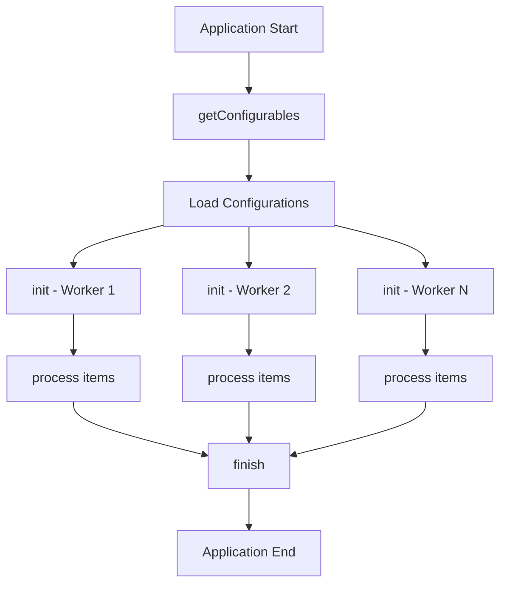

The Task API enables developers to create custom processing modules that integrate into IPED's processing pipeline.

## AbstractTask Class

**Package**: `iped.engine.task`  
**Source**: `iped-engine/src/main/java/iped/engine/task/AbstractTask.java`

The `AbstractTask` class is the base class for all processing tasks in IPED. Each worker thread maintains its own instances of tasks.

## Creating a Custom Task

Extend `AbstractTask` and implement the required abstract methods:

```java
import iped.engine.task.AbstractTask;
import iped.data.IItem;
import iped.configuration.Configurable;
import iped.engine.config.ConfigurationManager;
import java.util.List;
import java.util.Collections;

public class CustomTask extends AbstractTask {
    
    @Override
    public List<Configurable<?>> getConfigurables() {
        // Return list of configuration objects
        return Collections.emptyList();
    }
    
    @Override
    public void init(ConfigurationManager configurationManager) throws Exception {
        // Initialize task, load configurations, models, etc.
        System.out.println("CustomTask initialized");
    }
    
    @Override
    protected void process(IItem evidence) throws Exception {
        // Process each item
        String name = evidence.getName();
        Long size = evidence.getLength();
        
        // Perform analysis
        if (name.endsWith(".pdf") && size > 1000000) {
            evidence.addCategory("large-documents");
            evidence.setExtraAttribute("documentSize", "large");
        }
    }
    
    @Override
    public void finish() throws Exception {
        // Clean up resources
        System.out.println("CustomTask finished");
    }
}
```

## Abstract Methods

### getConfigurables()

<ParamField path="getConfigurables()" type="List<Configurable<?>>">
  Returns a list of `Configurable` objects containing task-specific configuration options. These are loaded at startup and passed to `init()`. Can be used by UIs to query task options.
</ParamField>

```java
import iped.configuration.Configurable;
import iped.engine.config.ConfigurationManager;

@Override
public List<Configurable<?>> getConfigurables() {
    List<Configurable<?>> configurables = new ArrayList<>();
    configurables.add(new CustomTaskConfig());
    return configurables;
}
```

### init()

<ParamField path="init(ConfigurationManager configurationManager)" type="void">
  Performs task initialization. Called once per worker thread at startup. Use this to:
  - Load task configurations
  - Initialize models or resources
  - Validate dependencies
  - Set up per-thread state
</ParamField>

```java
private CustomTaskConfig config;
private MachineLearningModel model;

@Override
public void init(ConfigurationManager configurationManager) throws Exception {
    // Load configuration
    config = configurationManager.findObject(CustomTaskConfig.class);
    
    // Load model (each worker gets its own instance)
    model = new MachineLearningModel(config.getModelPath());
    model.load();
    
    // Check dependencies
    checkDependency(SignatureTask.class);
}
```

### process()

<ParamField path="process(IItem evidence)" type="void">
  Processes a single evidence item. This is the main task logic. Called for each item in the case.
</ParamField>

```java
@Override
protected void process(IItem evidence) throws Exception {
    // Skip items you don't need to process
    if (evidence.isDir() || evidence.getLength() == 0) {
        return;
    }
    
    // Access item properties
    String name = evidence.getName();
    String mediaType = evidence.getMediaType().toString();
    
    // Read content
    try (BufferedInputStream is = evidence.getBufferedInputStream()) {
        byte[] data = IOUtils.toByteArray(is);
        
        // Perform analysis
        AnalysisResult result = analyzeData(data);
        
        // Store results
        evidence.setExtraAttribute("customScore", result.getScore());
        
        if (result.isSuspicious()) {
            evidence.addCategory("suspicious");
        }
    }
}
```

### finish()

<ParamField path="finish()" type="void">
  Performs cleanup when task processing completes. Called once per worker thread. Use this to:
  - Release resources
  - Close files or connections
  - Save final statistics
</ParamField>

```java
@Override
public void finish() throws Exception {
    // Release model resources
    if (model != null) {
        model.close();
    }
    
    // Log statistics
    System.out.println("Processed items: " + processedCount);
}
```

## Protected Fields

Tasks have access to several protected fields:

<ParamField path="worker" type="Worker">
  The worker thread executing this task
</ParamField>

<ParamField path="stats" type="Statistics">
  Statistics object that can be updated by the task
</ParamField>

<ParamField path="output" type="File">
  Processing output directory where tasks can create subdirectories for results
</ParamField>

<ParamField path="caseData" type="CaseData">
  Represents the current case. Use `caseData.objectMap` to share objects between task instances.
</ParamField>

### Example: Accessing Protected Fields

```java
@Override
protected void process(IItem evidence) throws Exception {
    // Update statistics
    stats.incProcessed();
    
    // Write output file
    File taskOutput = new File(output, "custom-task-results");
    taskOutput.mkdirs();
    
    // Access shared objects
    HashMap<String, Integer> sharedMap = 
        (HashMap<String, Integer>) caseData.getCaseObject("sharedCounters");
}
```

## Task Configuration

### Optional Methods

<ParamField path="isEnabled()" type="boolean">
  Returns whether the task is enabled. Default is `true`. Override to implement enable/disable logic.
</ParamField>

<ParamField path="processIgnoredItem()" type="boolean">
  Returns whether the task should process ignored items (items with `hashDb:status=known`). Default is `false`.
</ParamField>

<ParamField path="processQueueEnd()" type="boolean">
  Returns whether the task should process special queue-end marker items. Default is `false`.
</ParamField>

```java
private boolean enabled = true;

@Override
public boolean isEnabled() {
    return enabled;
}

@Override
protected boolean processIgnoredItem() {
    // Process even known/ignored files
    return true;
}
```

## Creating Subitems

Tasks can create subitems when extracting embedded content:

```java
@Override
protected void process(IItem evidence) throws Exception {
    if (isContainerFormat(evidence)) {
        List<EmbeddedFile> embedded = extractEmbedded(evidence);
        
        for (EmbeddedFile file : embedded) {
            // Create subitem
            IItem subitem = evidence.createChildItem();
            
            // Set properties
            subitem.setName(file.getName());
            subitem.setLength(file.getSize());
            subitem.setParentId(evidence.getId());
            subitem.setSubItem(true);
            
            // Set content
            subitem.setInputStreamFactory(
                new ByteArrayInputStreamFactory(file.getData())
            );
            
            // Send to processing pipeline
            worker.processNewItem(subitem);
        }
        
        evidence.setHasChildren(true);
    }
}
```

## Checking Dependencies

Ensure required tasks are enabled:

```java
@Override
public void init(ConfigurationManager configurationManager) throws Exception {
    // Ensure required tasks are enabled
    checkDependency(SignatureTask.class);
    checkDependency(HashTask.class);
}
```

## Sharing Data Between Task Instances

Use the case object map to share data:

```java
private static final String SHARED_CACHE_KEY = "CustomTask.Cache";

@Override
public void init(ConfigurationManager configurationManager) throws Exception {
    // Create shared cache (synchronized for thread safety)
    ConcurrentHashMap<String, Object> cache = 
        (ConcurrentHashMap<String, Object>) caseData.getCaseObject(SHARED_CACHE_KEY);
    
    if (cache == null) {
        cache = new ConcurrentHashMap<>();
        caseData.putCaseObject(SHARED_CACHE_KEY, cache);
    }
}

@Override
protected void process(IItem evidence) throws Exception {
    ConcurrentHashMap<String, Object> cache = 
        (ConcurrentHashMap<String, Object>) caseData.getCaseObject(SHARED_CACHE_KEY);
    
    // Use shared cache
    String key = evidence.getHash();
    if (cache.containsKey(key)) {
        // Reuse cached result
        evidence.setExtraAttribute("result", cache.get(key));
    } else {
        // Compute and cache
        Object result = computeExpensiveResult(evidence);
        cache.put(key, result);
        evidence.setExtraAttribute("result", result);
    }
}
```

## Complete Example: Hash Lookup Task

```java
import iped.engine.task.AbstractTask;
import iped.data.IItem;
import iped.configuration.Configurable;
import iped.engine.config.ConfigurationManager;
import java.io.BufferedReader;
import java.io.FileReader;
import java.util.*;
import java.util.concurrent.ConcurrentHashMap;

public class HashLookupTask extends AbstractTask {
    
    private static final String CACHE_KEY = "HashLookupTask.HashSet";
    private Set<String> maliciousHashes;
    
    @Override
    public List<Configurable<?>> getConfigurables() {
        return Collections.emptyList();
    }
    
    @Override
    public void init(ConfigurationManager configurationManager) throws Exception {
        // Load hash database (shared across all workers)
        maliciousHashes = (Set<String>) caseData.getCaseObject(CACHE_KEY);
        
        if (maliciousHashes == null) {
            maliciousHashes = ConcurrentHashMap.newKeySet();
            
            // Load from file
            File hashFile = new File(output.getParentFile(), "conf/malicious-hashes.txt");
            if (hashFile.exists()) {
                try (BufferedReader br = new BufferedReader(new FileReader(hashFile))) {
                    String line;
                    while ((line = br.readLine()) != null) {
                        maliciousHashes.add(line.trim().toLowerCase());
                    }
                }
            }
            
            caseData.putCaseObject(CACHE_KEY, maliciousHashes);
            System.out.println("Loaded " + maliciousHashes.size() + " malicious hashes");
        }
        
        // Ensure hash task runs first
        checkDependency(HashTask.class);
    }
    
    @Override
    protected void process(IItem evidence) throws Exception {
        String hash = evidence.getHash();
        
        if (hash != null && !hash.isEmpty()) {
            if (maliciousHashes.contains(hash.toLowerCase())) {
                evidence.addCategory("malware");
                evidence.setExtraAttribute("malwareDetected", true);
                evidence.setExtraAttribute("detectionMethod", "hash-lookup");
            }
        }
    }
    
    @Override
    public void finish() throws Exception {
        System.out.println("HashLookupTask completed");
    }
}
```

## Complete Example: File Classifier Task

```java
import iped.engine.task.AbstractTask;
import iped.data.IItem;
import org.apache.commons.io.IOUtils;
import java.io.BufferedInputStream;
import java.util.*;

public class FileClassifierTask extends AbstractTask {
    
    private int processedCount = 0;
    private int classifiedCount = 0;
    
    @Override
    public List<Configurable<?>> getConfigurables() {
        return Collections.emptyList();
    }
    
    @Override
    public void init(ConfigurationManager configurationManager) throws Exception {
        System.out.println("FileClassifier initialized for worker " + worker.getName());
    }
    
    @Override
    protected void process(IItem evidence) throws Exception {
        processedCount++;
        
        // Skip directories and empty files
        if (evidence.isDir() || evidence.getLength() == null || evidence.getLength() == 0) {
            return;
        }
        
        String category = classifyFile(evidence);
        
        if (category != null) {
            evidence.addCategory(category);
            evidence.setExtraAttribute("autoClassified", true);
            classifiedCount++;
        }
    }
    
    private String classifyFile(IItem item) throws Exception {
        String mediaType = item.getMediaType().toString();
        Long size = item.getLength();
        
        // Classify based on media type and size
        if (mediaType.startsWith("image/")) {
            if (size > 5000000) {
                return "large-images";
            }
        } else if (mediaType.startsWith("video/")) {
            if (size > 100000000) {
                return "large-videos";
            }
        } else if (mediaType.equals("application/pdf")) {
            // Check if PDF contains text
            if (hasSignificantText(item)) {
                return "text-documents";
            } else {
                return "scanned-documents";
            }
        }
        
        return null;
    }
    
    private boolean hasSignificantText(IItem item) throws Exception {
        // Simple heuristic: check if parsed text exists and has reasonable length
        Object textAttr = item.getExtraAttribute("parsedText");
        if (textAttr != null && textAttr.toString().length() > 100) {
            return true;
        }
        return false;
    }
    
    @Override
    public void finish() throws Exception {
        System.out.println("FileClassifier finished:");
        System.out.println("  Processed: " + processedCount);
        System.out.println("  Classified: " + classifiedCount);
    }
}
```

## Registering Tasks

To use your custom task, register it in IPED's configuration:

1. Compile your task and package it as a JAR
2. Place the JAR in IPED's `lib` or `plugins` directory
3. Add the task to `conf/TaskInstaller.xml`:

```xml
<task class="com.example.CustomTask" />
```

## Task Lifecycle



## Best Practices

<Tip>
  **Thread-Safe Shared State**: When sharing data between task instances using `caseData.objectMap`, use thread-safe collections like `ConcurrentHashMap`.
</Tip>

<Warning>
  **Resource Management**: Always release resources in `finish()`. Each worker thread has its own task instances.
</Warning>

<Tip>
  **Performance**: Skip unnecessary processing early in the `process()` method. Check file type, size, or other properties before expensive operations.
</Tip>

<Tip>
  **Dependencies**: Use `checkDependency()` to ensure required tasks are enabled and run before yours.
</Tip>

<Warning>
  **Exceptions**: Let exceptions propagate unless you have a specific reason to handle them. IPED's framework handles task failures gracefully.
</Warning>

## Task Execution Order

Tasks execute in the order defined in `TaskInstaller.xml`. Consider dependencies when ordering:

1. **SignatureTask** - Detect file types
2. **HashTask** - Compute hashes
3. **ParsingTask** - Extract text content
4. **Your custom tasks** - Use results from previous tasks

## Debugging Tasks

Enable detailed logging:

```java
import org.slf4j.Logger;
import org.slf4j.LoggerFactory;

private static Logger logger = LoggerFactory.getLogger(CustomTask.class);

@Override
protected void process(IItem evidence) throws Exception {
    logger.info("Processing: " + evidence.getName());
    logger.debug("Size: " + evidence.getLength());
}
```

## See Also

- [Item API](/api/item-api) - Access and modify item properties
- [Search API](/api/search-api) - Query items in tasks
- [Configuration Guide](/processing/configuration) - Configure task behavior