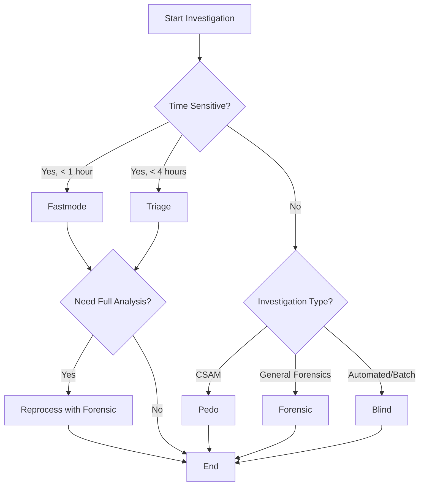

IPED provides five specialized processing profiles that optimize the tool for different investigation scenarios. Each profile enables or disables specific features to balance processing speed, resource usage, and analysis depth.

## Overview

Processing profiles are pre-configured sets of options that adjust IPED's behavior for specific use cases:

<CardGroup cols={2}>
  <Card title="Forensic" icon="microscope">
    **Full forensic analysis**
    
    Complete processing with all standard forensic features enabled
  </Card>
  
  <Card title="Pedo (CSAM)" icon="shield-halved">
    **Child exploitation investigations**
    
    Specialized detection and analysis for CSAM cases
  </Card>
  
  <Card title="Triage" icon="gauge-high">
    **Fast on-scene analysis**
    
    Quick processing with basic indexing for immediate results
  </Card>
  
  <Card title="Fastmode" icon="bolt">
    **Rapid preview**
    
    Minimal processing for fastest possible case preview
  </Card>
  
  <Card title="Blind" icon="robot">
    **Automated extraction**
    
    Headless processing for automatic data extraction
  </Card>
</CardGroup>

## Using Profiles

Specify a profile using the `-profile` parameter:

```bash Terminal
java -jar iped.jar -d /evidence/disk.E01 -o /cases/case001 -profile forensic
```

If no profile is specified, IPED uses the default configuration (similar to forensic mode).

## Profile Details

### Forensic Profile

<Icon icon="microscope" /> **Best for: Complete forensic investigations**

The forensic profile enables comprehensive analysis suitable for most digital forensic investigations. It provides a balanced approach with all standard features.

#### Enabled Features

- **Hash computation** - MD5, SHA-1, SHA-256, SHA-512, edonkey
- **Hash database lookups** - NIST NSRL, NIST CAID, Project VIC
- **QR code detection** - Scan and decode QR codes
- **Data carving** - Recover deleted files from unallocated space
- **Image similarity** - Find similar and duplicate images
- **Signature analysis** - Verify file types by magic bytes
- **Container expansion** - Extract embedded archives and containers
- **Full text indexing** - Index file contents for searching
- **Regex searches** - Find credit cards, emails, URLs, etc.
- **File parsing** - Extract metadata from common file types

#### Configuration

```text IPEDConfig.txt
enableHashDBLookup = true
enableQRCode = true
enableCarving = true
enableImageSimilarity = true
```

#### Use Cases

<CardGroup cols={1}>
  <Card>
    - Criminal investigations requiring comprehensive evidence analysis
    - Corporate fraud and intellectual property theft cases
    - General-purpose digital forensics examinations
    - Cases requiring detailed reporting and documentation
  </Card>
</CardGroup>

#### Processing Time

Expect **400GB/hour** on modern hardware (16+ cores, 32GB+ RAM, SSD storage).

---

### Pedo Profile (CSAM)

<Icon icon="shield-halved" /> **Best for: Child exploitation investigations**

<Warning>
  This profile is specifically designed for law enforcement investigating child sexual abuse material (CSAM). It includes specialized detection capabilities.
</Warning>

The pedo profile maximizes detection capabilities for CSAM investigations with advanced image analysis and classification.

#### Enabled Features

All forensic profile features **plus**:

- **PhotoDNA hashing** - Microsoft PhotoDNA for known CSAM detection (law enforcement only)
- **PhotoDNA lookups** - Check against PhotoDNA databases
- **LED carving** - Enhanced carving for known exploitative content
- **Known metadata carving** - Recover files matching known CSAM metadata
- **Face recognition** - Detect and match faces across evidence
- **Age estimation** - Estimate ages of individuals in images
- **Remote image classifier** - Cloud-based image content classification
- **Enhanced video processing** - More comprehensive video analysis

#### Configuration

```text IPEDConfig.txt
enablePhotoDNA = true
enableHashDBLookup = true
enablePhotoDNALookup = true
enableLedDie = true
enableQRCode = true
enableCarving = true
enableLedCarving = true
enableKnownMetCarving = true
enableImageSimilarity = true
enableFaceRecognition = true
enableAgeEstimation = true
enableRemoteImageClassifier = true
```

#### Use Cases

<CardGroup cols={1}>
  <Card>
    - Law enforcement CSAM investigations
    - Cases requiring PhotoDNA database matching
    - Investigations needing face recognition and age analysis
    - Enhanced image and video content detection
  </Card>
</CardGroup>

#### Requirements

<Note>
  PhotoDNA is available **only for law enforcement**. Contact iped@pf.gov.br for access.
</Note>

#### Processing Time

Expect **150-250GB/hour** due to intensive image analysis (requires significant CPU and RAM).

---

### Triage Profile

<Icon icon="gauge-high" /> **Best for: On-scene rapid assessment**

The triage profile provides fast processing with basic search capabilities for immediate results at the scene or during initial case assessment.

#### Enabled Features

- **Basic file enumeration** - List all files with metadata
- **File signature detection** - Limited signature verification
- **Text indexing** - Basic content indexing for searches
- **File parsing** - Essential metadata extraction
- **Regex searches** - Search for patterns (emails, phones, etc.)
- **Container expansion** - Extract archives (disabled by default)
- **Cryptocurrency wallet detection** - Find hardware wallet files

#### Disabled Features

- Hash computation
- PhotoDNA
- Hash database lookups
- Carving
- Image/video thumbnails
- Image similarity
- Face recognition
- Language detection
- Named entity recognition
- Graph generation
- Audio transcription
- HTML report generation

#### Configuration

```text IPEDConfig.txt
enableHash = false
enableHashDBLookup = false
enableCarving = false
enableImageThumbs = false
enableImageSimilarity = false
enableFaceRecognition = false
indexFileContents = true
enableRegexSearch = true
enableSearchHardwareWallets = true
```

#### Use Cases

<CardGroup cols={1}>
  <Card>
    - On-scene processing for immediate keyword searches
    - Quick assessment before full forensic analysis
    - Time-sensitive investigations requiring fast results
    - Preview processing to determine investigation direction
  </Card>
</CardGroup>

#### Processing Time

Expect **800-1200GB/hour** - approximately 2-3x faster than forensic profile.

<Tip>
  Use triage profile at the scene, then reprocess with forensic profile in the lab for complete analysis.
</Tip>

---

### Fastmode Profile

<Icon icon="bolt" /> **Best for: Ultra-fast case preview**

The fastmode profile provides the absolute fastest processing with minimal analysis. Use this when you need to open and browse evidence as quickly as possible.

#### Enabled Features

- **Basic file enumeration** - List files with basic metadata
- **Minimal indexing** - No content indexing for maximum speed

#### Disabled Features

Almost all processing features are disabled:

- Hash computation
- File signature verification
- File parsing
- Container expansion
- Text indexing
- Regex searches
- Carving
- Thumbnails
- All image/video analysis
- Report generation

#### Configuration

```text IPEDConfig.txt
enableHash = false
enableFileParsing = false
expandContainers = false
indexFileContents = false
enableRegexSearch = false
enableCarving = false
enableImageThumbs = false
enableVideoThumbs = false
enableHTMLReport = false
```

#### Use Cases

<CardGroup cols={1}>
  <Card>
    - Emergency situations requiring immediate evidence access
    - Preview before deciding on full processing
    - Checking evidence integrity and contents
    - Quick file listing and basic browsing
  </Card>
</CardGroup>

#### Processing Time

Expect **2000-3000GB/hour** - the fastest possible processing mode.

<Warning>
  Fastmode does NOT index file contents. You can browse files but cannot perform text searches.
</Warning>

---

### Blind Profile

<Icon icon="robot" /> **Best for: Automated data extraction**

The blind profile is designed for automated, headless processing that extracts and exports specific data without requiring user interaction or GUI.

#### Enabled Features

- **Hash database lookups** - Identify known files
- **Automatic export** - Export files matching configured criteria
- **Data carving** - Recover deleted files
- **Selective processing** - Process only specified file types

#### Typical Configuration

- No GUI required
- Automatic export of categorized files
- Minimal user interaction
- Optimized for scripting and automation

#### Configuration

```text IPEDConfig.txt
enableHashDBLookup = true
enableAutomaticExportFiles = true
enableCarving = true
```

#### Use Cases

<CardGroup cols={1}>
  <Card>
    - Automated batch processing of multiple cases
    - Extraction of specific file types (e.g., all documents)
    - Integration with other tools via scripting
    - Headless server-based processing
    - Continuous integration/automated workflows
  </Card>
</CardGroup>

#### Example Script

```bash automation.sh
#!/bin/bash

# Automated processing with blind profile
for case in /evidence/*.E01; do
  output="/cases/$(basename "$case" .E01)"
  
  java -jar iped.jar \
    --nogui \
    -profile blind \
    -d "$case" \
    -o "$output" \
    --nologfile
    
  # Export results to central repository
  rsync -av "$output/data/" "/repository/$(basename "$case" .E01)/"
done
```

#### Processing Time

Variable depending on enabled features, typically **300-500GB/hour**.

---

## Profile Comparison

<Tabs>
  <Tab title="Feature Comparison">
    | Feature | Forensic | Pedo | Triage | Fastmode | Blind |
    |---------|----------|------|--------|----------|-------|
    | Hash computation | ✓ | ✓ | ✗ | ✗ | ✓ |
    | Hash lookups | ✓ | ✓ | ✗ | ✗ | ✓ |
    | PhotoDNA | ✗ | ✓ | ✗ | ✗ | ✗ |
    | Data carving | ✓ | ✓ | ✗ | ✗ | ✓ |
    | Text indexing | ✓ | ✓ | ✓ | ✗ | ✗ |
    | Image similarity | ✓ | ✓ | ✗ | ✗ | ✗ |
    | Face recognition | ✗ | ✓ | ✗ | ✗ | ✗ |
    | Regex searches | ✓ | ✓ | ✓ | ✗ | ✗ |
    | File parsing | ✓ | ✓ | ✓ | ✗ | ✗ |
    | Container expansion | ✓ | ✓ | ✗ | ✗ | ✗ |
    | HTML reports | ✓ | ✓ | ✗ | ✗ | ✗ |
    | Auto export | ✗ | ✗ | ✗ | ✗ | ✓ |
  </Tab>
  
  <Tab title="Performance Comparison">
    | Profile | Speed (GB/h) | CPU Usage | RAM Usage | Best For |
    |---------|--------------|-----------|-----------|----------|
    | Forensic | 400 | High | 8-16GB | Complete investigation |
    | Pedo | 200 | Very High | 16-32GB | CSAM cases |
    | Triage | 1000 | Medium | 4-8GB | On-scene analysis |
    | Fastmode | 2500 | Low | 2-4GB | Quick preview |
    | Blind | 400 | Medium | 4-8GB | Automation |
    
    <Note>
      Performance varies based on hardware, evidence type, and configuration. Values shown are approximate with modern hardware.
    </Note>
  </Tab>
  
  <Tab title="Use Case Guide">
    <Steps>
      <Step title="Choose based on investigation type">
        - **Criminal investigation** → Forensic
        - **CSAM investigation** → Pedo
        - **At the scene** → Triage or Fastmode
        - **Automated processing** → Blind
      </Step>
      
      <Step title="Consider time constraints">
        - **Immediate results needed** → Fastmode
        - **Same-day results** → Triage
        - **Thorough analysis** → Forensic or Pedo
      </Step>
      
      <Step title="Account for resources">
        - **Limited hardware** → Triage or Fastmode
        - **Powerful workstation** → Forensic or Pedo
        - **Batch processing** → Blind
      </Step>
    </Steps>
  </Tab>
</Tabs>

## Customizing Profiles

Profiles are stored in `iped-app/resources/config/profiles/<profile_name>/` and can be customized.

### Profile Structure

```
profiles/
├── forensic/
│   ├── IPEDConfig.txt          # Main profile configuration
│   └── conf/
│       ├── IndexTaskConfig.txt  # Index settings
│       ├── HashTaskConfig.txt   # Hash settings
│       └── ...                  # Other module configs
├── pedo/
│   ├── IPEDConfig.txt
│   └── conf/
├── triage/
│   ├── IPEDConfig.txt
│   └── conf/
└── ...
```

### Creating Custom Profiles

<Steps>
  <Step title="Copy existing profile">
    ```bash Terminal
    cd iped-app/resources/config/profiles
    cp -r forensic custom_profile
    ```
  </Step>
  
  <Step title="Edit IPEDConfig.txt">
    Modify the configuration to enable/disable features:
    ```text IPEDConfig.txt
    enableHash = true
    enableCarving = false
    enableImageSimilarity = true
    # Add more settings...
    ```
  </Step>
  
  <Step title="Customize module configs">
    Edit files in the `conf/` subdirectory for fine-tuned control.
  </Step>
  
  <Step title="Use your profile">
    ```bash Terminal
    java -jar iped.jar -d /evidence/disk.E01 -profile custom_profile -o /cases/case001
    ```
  </Step>
</Steps>

## Profile Selection Workflow



## Best Practices

<AccordionGroup>
  <Accordion title="Start with triage for large cases">
    Process large cases first with triage profile to get initial results, then determine if full forensic processing is needed:
    
    ```bash Terminal
    # Step 1: Triage
    java -jar iped.jar -d /evidence/large.E01 -profile triage -o /cases/triage_001
    
    # Review results, then...
    
    # Step 2: Full processing
    java -jar iped.jar -d /evidence/large.E01 -profile forensic -o /cases/full_001
    ```
  </Accordion>
  
  <Accordion title="Use appropriate profiles for case type">
    Don't use the pedo profile for general cases - the extra processing takes significant time. Match the profile to your investigation needs.
  </Accordion>
  
  <Accordion title="Document profile choice">
    Record which profile was used in your case notes for reproducibility and to explain processing decisions in court.
  </Accordion>
  
  <Accordion title="Test profiles on sample data">
    Before processing critical evidence, test different profiles on sample data to understand processing times and results.
  </Accordion>
  
  <Accordion title="Combine with appropriate hardware">
    - Fastmode/Triage: Can run on laptops at the scene
    - Forensic: Requires workstation with 16GB+ RAM
    - Pedo: Requires powerful workstation with 32GB+ RAM
  </Accordion>
</AccordionGroup>

## Next Steps

<CardGroup cols={2}>
  <Card title="Command-Line Options" icon="terminal" href="/processing/command-line">
    Learn all available command-line parameters for processing
  </Card>
  
  <Card title="Configuration" icon="gear" href="/processing/configuration">
    Deep dive into IPED configuration files and options
  </Card>
  
  <Card title="Data Sources" icon="hard-drive" href="/processing/data-sources">
    Understand supported evidence formats and sources
  </Card>
  
  <Card title="Performance Tuning" icon="gauge" href="/advanced/performance">
    Optimize IPED for maximum processing speed
  </Card>
</CardGroup>